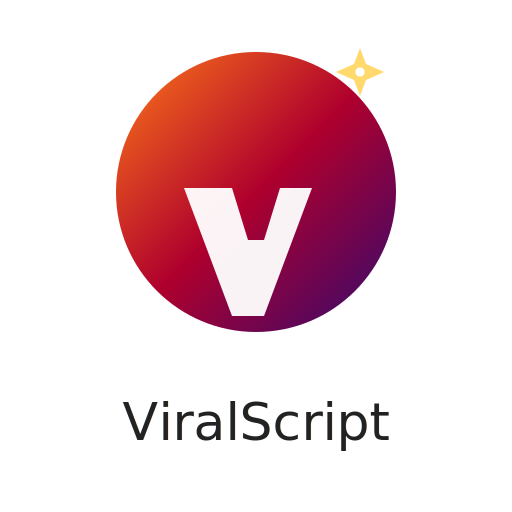

# ViralScript

ViralScript is a small client-side web app that helps generate and manage short, catchy hooks for social posts and marketing. It's built with plain HTML, CSS and JavaScript so you can run it locally by opening `index.html` in a browser.

## Demo
Open `index.html` in your browser to try the app locally. No server or build step required.

## Key Features
- Lightweight, dependency-free front-end.
- Generates and stores hooks using local storage.
- Includes simple AI/assistive script components (see `assets/js/ai.js`).

## File structure
- `index.html` — main entry point for the app.
- `hooks.json` — sample hook bank data used by the app.
- `assets/`
  - `css/style.css` — app styles.
  - `js/` — application JavaScript files:
    - `ai.js` — AI helper logic.
    - `hookbank.js` — hook bank loader and helper functions.
    - `main.js` — main UI logic.
    - `storage.js` — localStorage helpers.
  - `img/` — app assets (created: `logo.svg`).

## Logo
A scalable SVG logo was added at `assets/img/logo.svg`. You can reference it in `index.html` (for example inside the header) like:

To customize the logo, open `assets/img/logo.svg` and edit the SVG text and colors.

## How to run
1. Clone or download the repository.
2. Open `index.html` in your browser (double-click or drag into a browser window).

No installation is required.

## Contributing
Small bug fixes, accessibility improvements, or logo refinements are welcome. Open a PR or edit the files directly.

## License
This project is provided as-is. Include a license file if you want to specify reuse terms.

## Contact
If you need help or want improvements, leave a note in the repository or contact the project maintainer.
